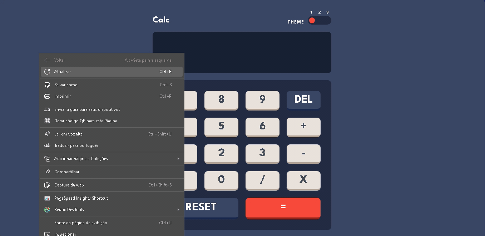
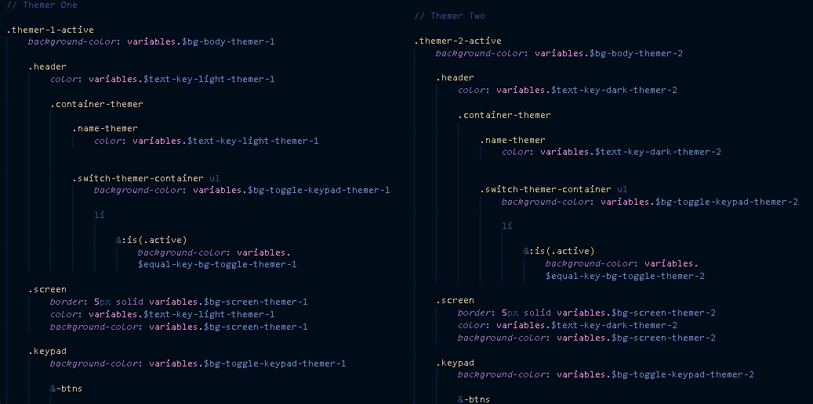
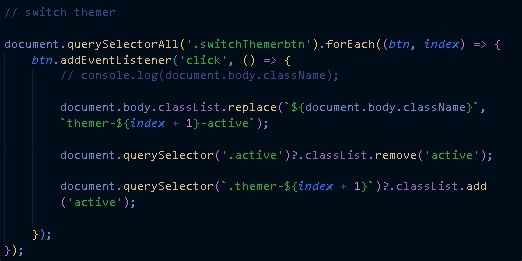
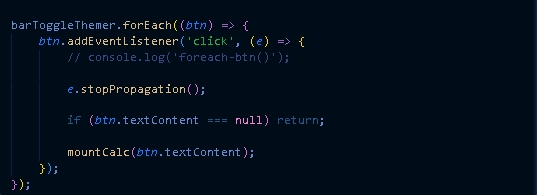
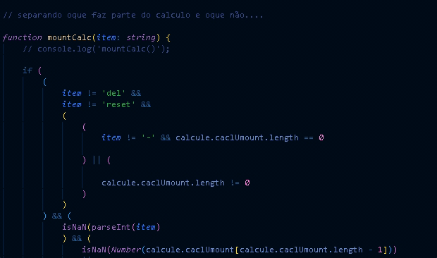
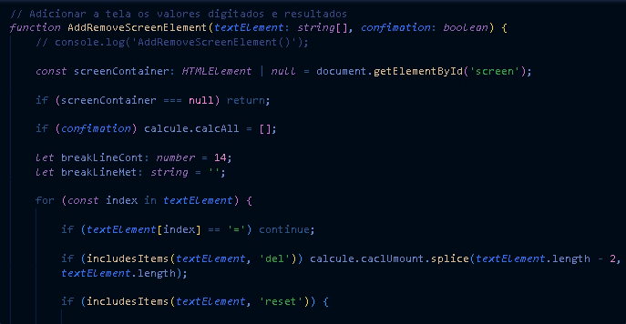
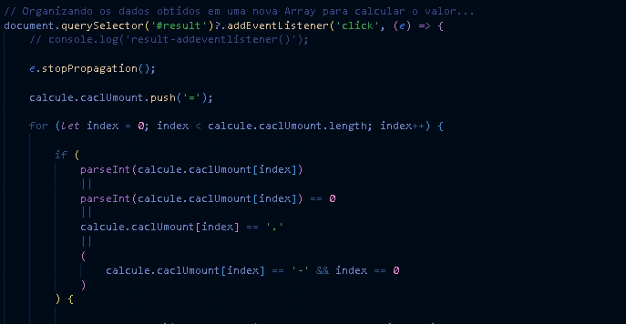
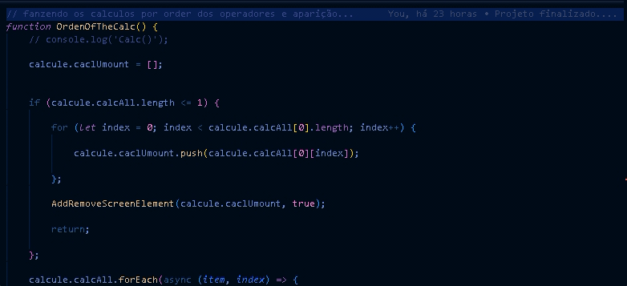
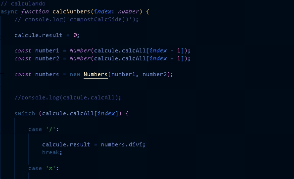
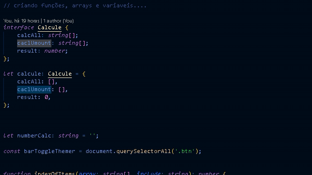

# 💻 Calculadora

<div align='center'>

</div>

## 📖Descrição

- Sendo um app para fazer cálculos, com os 4 operadores básicos disponíveis, ele segue um padrão de cálculo. Primeiro, realiza as operações de ✖️ multiplicação e ➗ divisão, de acordo com a ordem em que foram ditadas, e depois realiza as operações de ➕ adição e ➖ subtração, seguindo o mesmo padrão.

## 🚀Hard Skills

- **HTML5**

- **CSS3**

- **Sass**

- **javaScript**

- **TypeScript**

## ⚔️Construção

- Inicialmente, a estrutura HTML foi construída e o estilo inicial foi definido para facilitar a visualização das funções em ação.

- No HTML, foi separado em 3 seções: o controle para trocar temas, a tela e os botões.

<div align='center'>

</div>

- Na criação da troca de temas, foi utilizada uma classe associada diretamente a um conjunto de estilos. Quando essa classe é trocada, ela é associada a outro conjunto de estilos.
  
<div align='center'>

</div>

- Na criação do evento que dispara a troca, foi utilizado o ```addEventListener``` com o evento de ```click```, e os botões de troca foram associados usando o ```forEach```…

<div align='center'>

</div>

Ao ser disparado, o índice e o botão são coletados, e a classe ‘active’ é removida, sendo utilizada para encontrar o item. Ambas as classes adicionadas ao ‘body’ têm quase o mesmo nome, diferenciando-se apenas pelo número de 1 a 3. Dessa forma, foi utilizado o índice para associá-las, criando chamadas personalizadas que dependem do índice do botão clicado.

<div align='center'>

</div>

- Na criação da função de identificação de qual botão foi clicado, foi usado o ```target.textContent``` para coletar o que estava dentro do botão.

<div align='center'>

</div>

- Já na parte de verificação dos dados, foram utilizadas condições de ```if``` para limitar a passagem de dados em determinados momentos. Por exemplo: quando houver um operador, não permitir a passagem de outro item que não seja um número. Contudo, é liberado para o ‘del’ e o ‘reset’, que são funções e não fazem parte do cálculo.

<div align='center'>

</div>

- Ao clicar nos botões e os valores serem verificados, eles passam para a parte de adição à tela da calculadora. Foi utilizado um loop com o ```for...in```, por passar o índice do elemento e ser mais simples que o for convencional. Dentro dele, foram criadas as verificações que limpam a tela (Reset) ou deletam o último elemento adicionado (DEL). Também foram criadas quebras de linha e modificações de estilo, dependendo da quantidade de dígitos. Como são apenas textos adicionados à tela, foi utilizado o ```innerText```.
  
<div align='center'>

</div>

- Ao clicar no botão de ‘=’, é iniciado o processo de criação de uma nova array que organiza os itens que antes estavam todos separados individualmente, juntando os números e mantendo os operadores separados.

<div align='center'>

</div>

- Logo após, vem a função que tem como objetivo organizar a ordem de cálculo, seguindo o padrão de ordem de operadores e precedência. Ao finalizar, ela adiciona o resultado à tela e o libera para ser utilizado em um novo cálculo.

<div align='center'>

</div>

- A função responsável por calcular recebe um índice que é associado à Array que está globalmente e identifica o operador, fazendo o cálculo e substituindo os valores anteriores pelo atual com o ```splice```, re-chamando a função responsável por identificar o próximo valor a ser calculado.

<div align='center'>

</div>

- Foram criadas funções, interfaces e variáveis para diminuir o código que se repetia.

<div align='center'>

</div>

## 📜LIcença

licença ( MIT ) - acesse aqui: [LICENSE](./LICENSE.txt)  