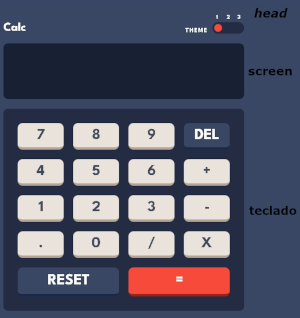

# 💻 Calculadora

## 📖Descrição

    Sendo um app para fazer calculos, tendo os 4 operadores basicos displonives, ela segue um padrão de calculo, fazendo primeiro os operadores ✖️Vezes e ➗dividir primeiro de acordo com a orden em que foi ditado e depois ➕mais e ➖menos seguindo o mesmo padrão.

## 🚀Hard Skills

- **HTML5**

- **CSS3**

- **Sass**

- **javaScript**

- **TypeScript**

## ⚔️Construção

    Inicial fora construido a estrutura htlm e o estilo inicial para poder facilitar a vizualização das funções em ação.

    No html fora separado em 3 seções o do controle de trocar temas, a tela e os botões.

